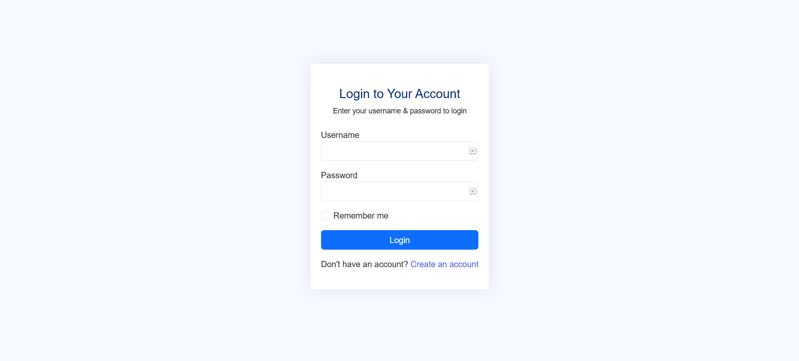
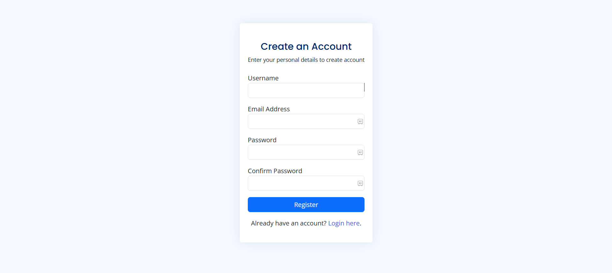
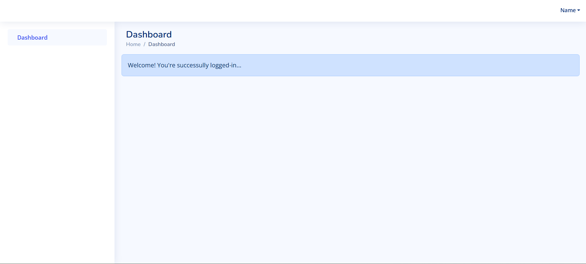

# Secure PHP Authentication System

A secure and robust authentication system built with PHP. This project implements user registration, login, password hashing, session management, and logout functionality. Designed for beginner to intermediate developers to understand and implement authentication in PHP-based projects.

## Login View

## Register View

## Dashboard View

